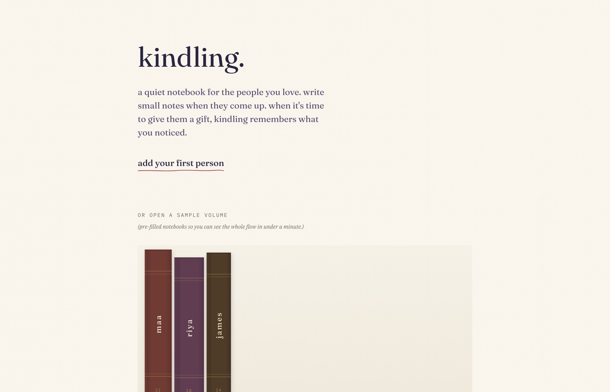
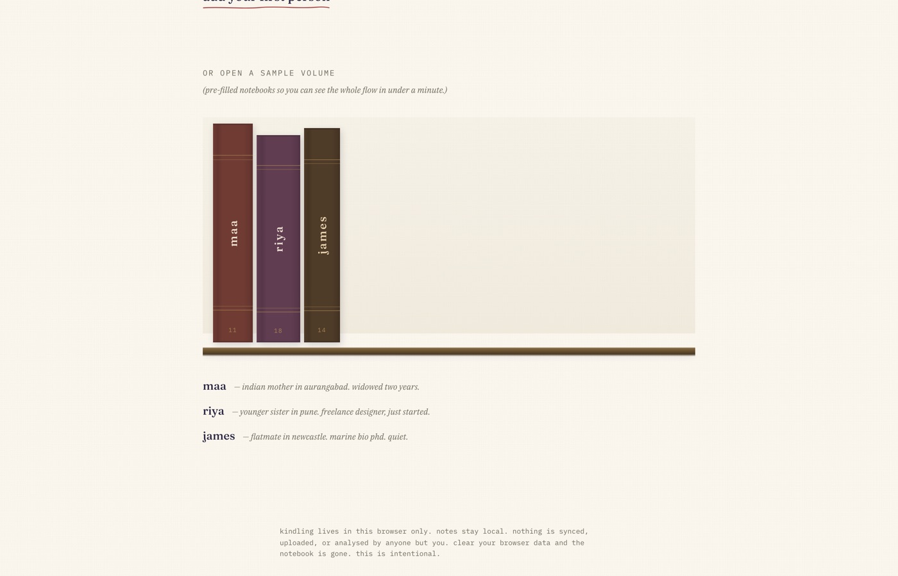
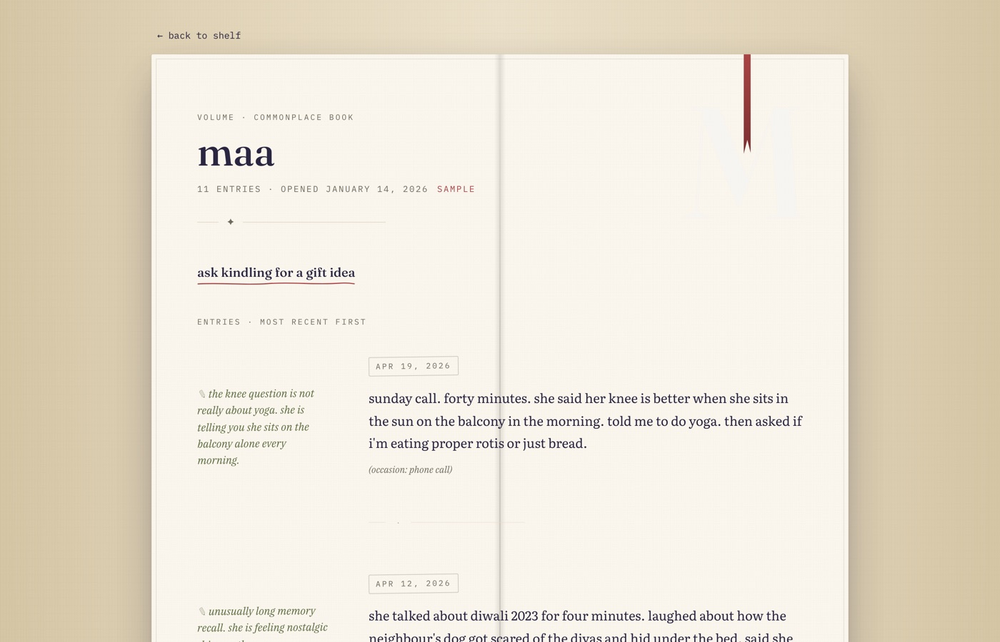
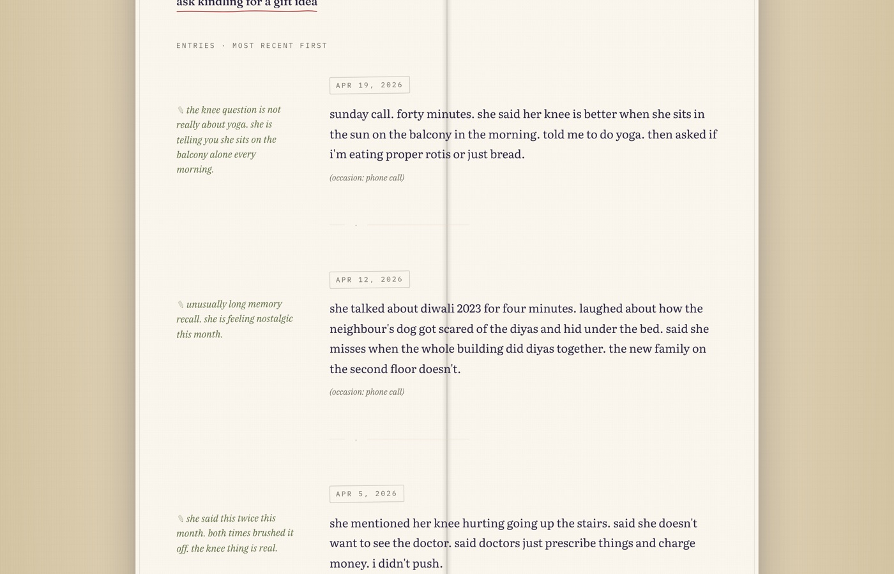
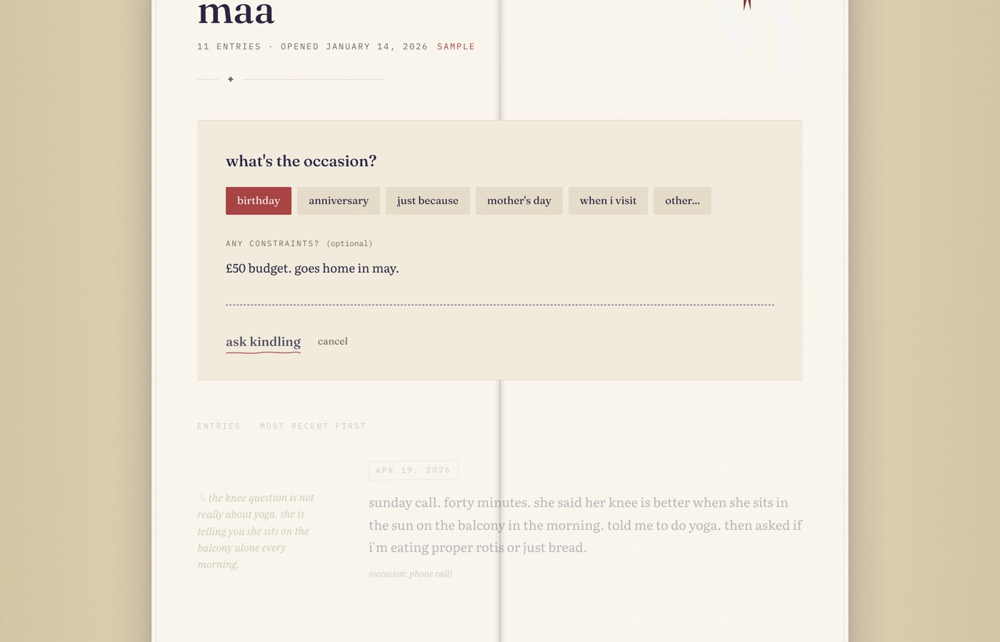
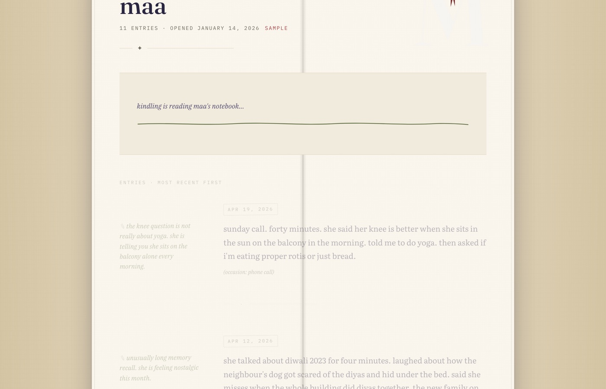
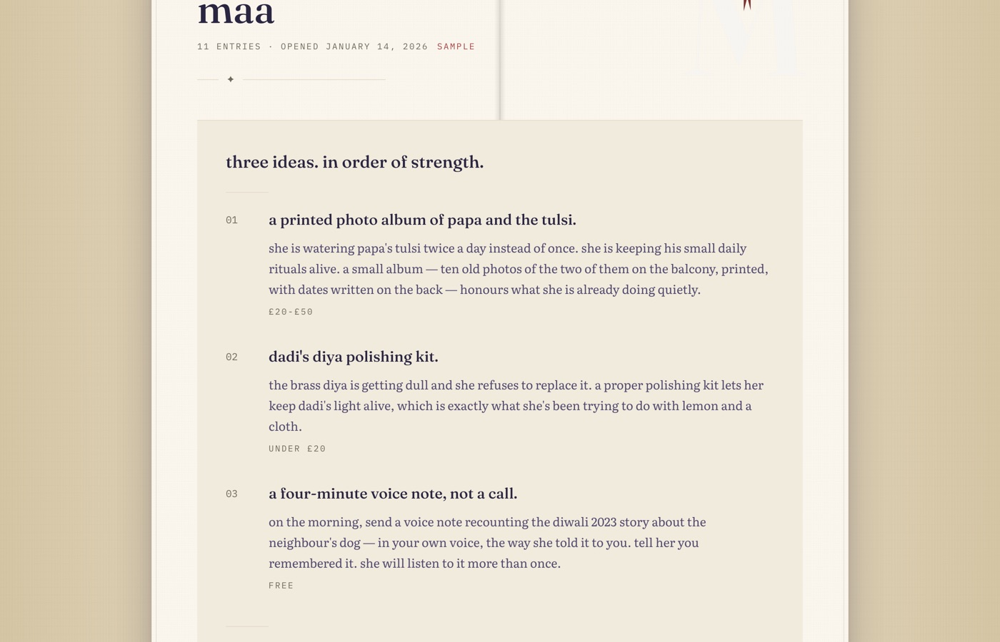
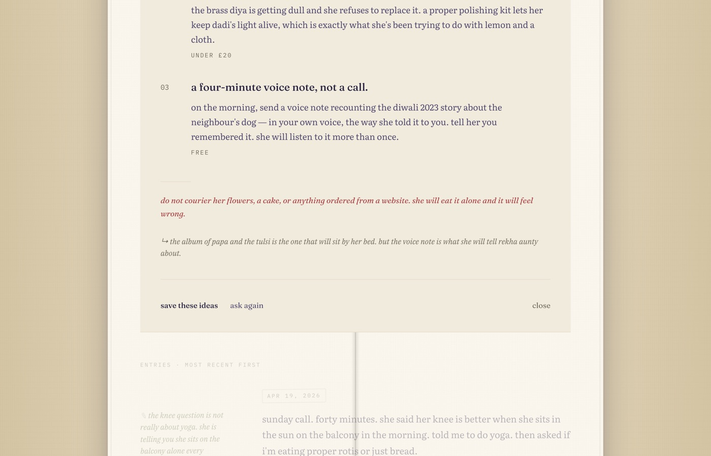
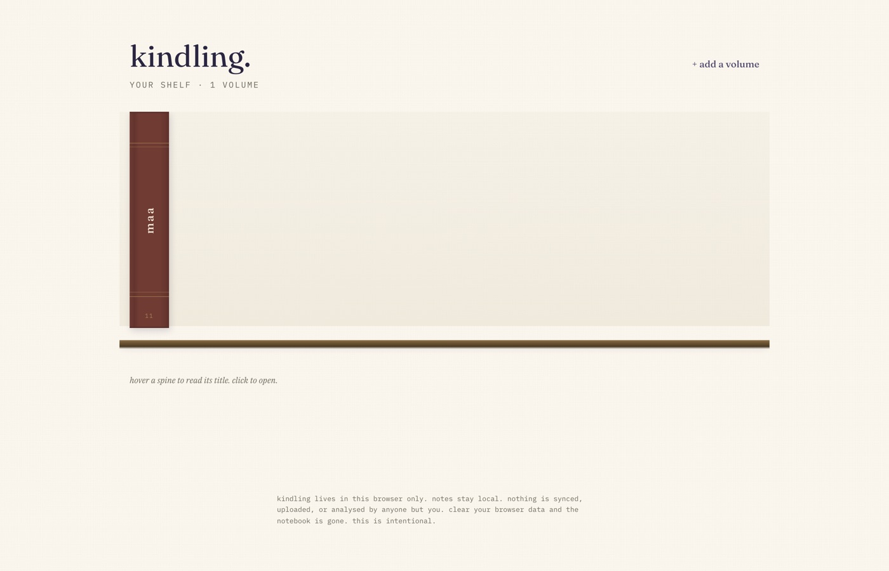
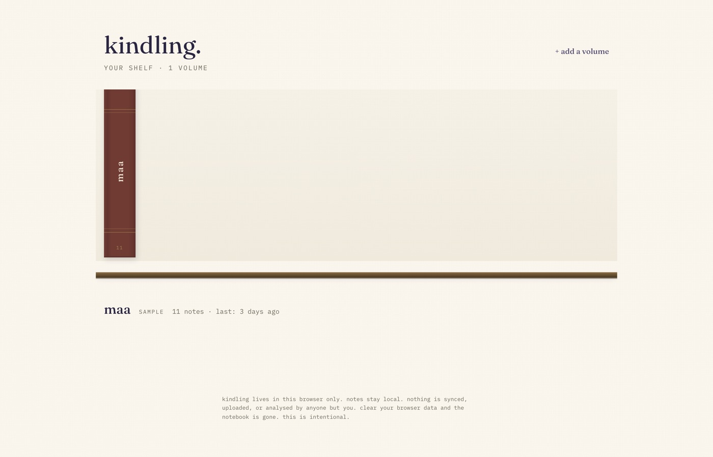

# kindling.

a quiet notebook for the people you love. write small notes when they come up. when it's time to give them a gift, kindling remembers what you noticed.

> every other social app rewards you for posting. kindling rewards you for paying attention to someone else.

**live:** https://kindling-ten.vercel.app

---

## demo


a 20-second walk through the flow: empty shelf → sample bookshelf → opening maa's volume → writing in an entry with a margin annotation → asking kindling for a birthday idea → three gift suggestions arriving like a letter.

higher-quality mp4: [`docs/demo/walkthrough.mp4`](./docs/demo/walkthrough.mp4)

### screens

| shelf — empty | shelf — samples |
|---|---|
|  |  |

| volume page (top) | entries with margin notes |
|---|---|
|  |  |

| ask panel | pencil-line loading |
|---|---|
|  |  |

| three ideas | do-not-get-them + verdict |
|---|---|
|  |  |

| populated shelf | hover a spine |
|---|---|
|  |  |

---

## what it is

a single-page web app for keeping a commonplace book about the people you love — not a feed, not a contact list, not a crm. notes stay in your browser. nothing syncs, nothing uploads. if you clear your browser data the notebook goes with it. this is intentional.

three pre-built sample notebooks (maa, riya, james) ship with the app so the demo works offline, with no keys, in under a minute.

## stack

- react 19 + vite 6
- tailwind css v4
- framer motion (subtle animations only)
- localStorage for persistence
- deployed to vercel

no backend. no accounts. no api keys required to run the samples.

## the design

the ui is a commonplace book, not a dashboard:

- **shelf** — your people appear as cloth-bound book spines on a wooden shelf. hover a spine to read its title; click to open the volume. overdue people get a red ribbon bookmark peeking out the top.
- **volume page** — an open book spread on a warm tan desk: deckle-edge inner border, centre-binding shadow, faded monogram, ribbon bookmark, and a fleuron rule under the header. entries are dated like diary entries, with quiet olive pencil-margin annotations slightly rotated in the left gutter.
- **ask kindling** — type an occasion, wait for a pencil line to draw across the page, and read three gift ideas written in the voice of a very close older cousin who has been paying attention.

palette: warm paper (#FAF6EE), cream, linen, deep indigo ink, soft burnt ember, olive pencil. typefaces: fraunces, literata, ibm plex serif, ibm plex mono.

## run locally

```bash
npm install
npm run dev
```

## reproduce the demo

```bash
npm run dev                       # in one terminal
npx playwright install chromium   # once, if not already installed
node scripts/capture-demo.mjs     # writes docs/demo/*.jpg + walkthrough.{mp4,gif}
```

## build + deploy

```bash
npm run build
vercel deploy --prod
```

## the voice (a quick guide)

- lowercase throughout. british spelling. no em dashes.
- never uses: thoughtful, meaningful, curated, special, celebrate, unlock, perfect.
- references specific notes, not generic demographics.
- if a line could appear in a moonpig email, it gets rewritten.

## thesis, in one sentence

every other social app rewards you for posting. kindling rewards you for paying attention to someone else.
